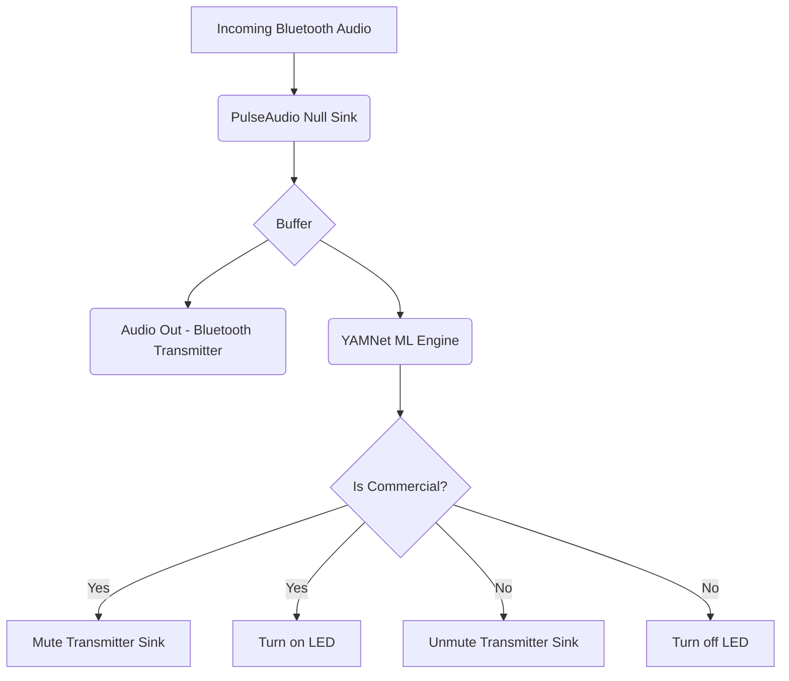

# AdMute Architecture & System Flow

The AdMute device sits as a "Man-in-the-Middle" between your Apple TV and your Altec Lansing HydraMotion speaker. By intercepting the Bluetooth audio stream, it performs real-time Machine Learning inference using YAMNet to detect commercials and disconnects the outgoing audio when one is found.

## Hardware Flow (Dual-Bluetooth)

### Flow Description:
1. **Input (Radio 1)**: The Apple TV pairs with the Raspberry Pi's built-in Bluetooth. The Pi advertises itself as a Bluetooth Audio Receiver (A2DP Sink).
2. **Processing**: Inside the Pi, the incoming audio stream is routed to two places simultaneously:
   - **Audio Output**: A virtual audio sink that routes to the second Bluetooth radio.
   - **ML Pipeline**: A Python script capturing short chunks of the audio to feed into the YAMNet model.
3. **Output (Radio 2)**: The Pi connects to the HydraMotion speaker using the USB Bluetooth Dongle (A2DP Source).

## Software Flow

### The "Muting Dilemma" Solution
By muting only the *Transmitter Sink*, the YAMNet ML Engine continues to receive the *Incoming Audio* from the Apple TV even when the HydraMotion speaker is silent. This allows the model to instantly detect when the commercial is over and the regular programming returns, at which point it unmutes the Transmitter Sink.
