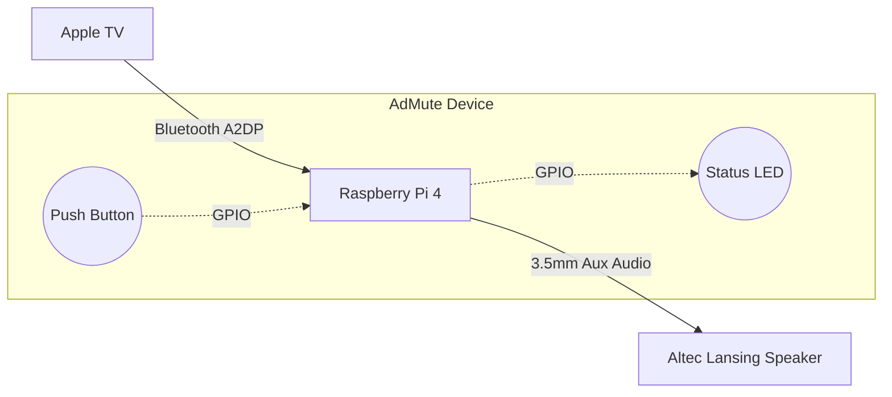
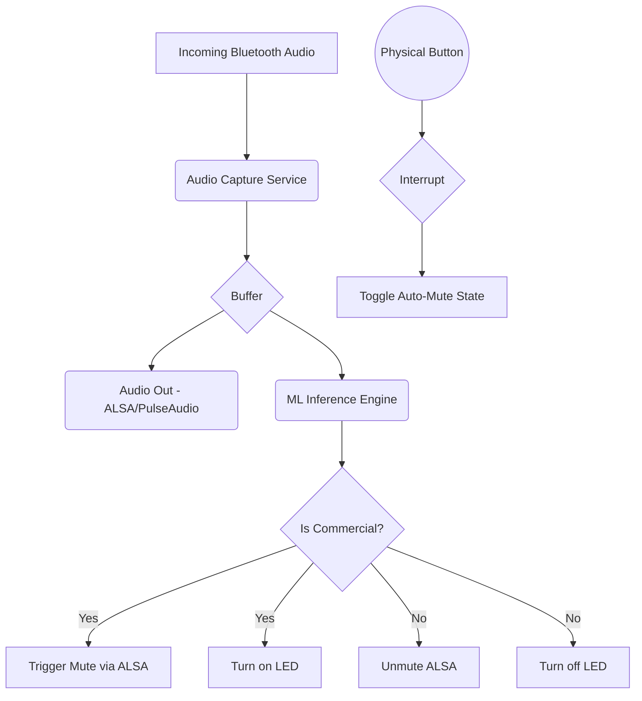

# AdMute Architecture & System Flow

The AdMute device sits as a "Man-in-the-Middle" between your Apple TV and your Altec Lansing speaker. By intercepting the audio stream, it can perform real-time Machine Learning inference to detect commercials and mute the output.

## Hardware Flow

### Flow Description:
1. **Input**: The Apple TV pairs with the Raspberry Pi. The Pi advertises itself as a Bluetooth Audio Receiver (A2DP Sink).
2. **Processing**: Inside the Pi, the incoming audio stream is routed to two places simultaneously:
   - **Audio Output**: The hardware 3.5mm jack.
   - **ML Pipeline**: A Python script capturing short chunks (e.g., 1-second rolling windows) of the audio.
3. **Output**: The Pi connects to the Altec Lansing speaker via a standard 3.5mm Aux cable.

## Software Flow

### Components
1. **Audio Server (PulseAudio / PipeWire)**: Manages the Bluetooth connection from the Apple TV and the ALSA output to the 3.5mm jack.
2. **Python Capture Script**: Uses `pyaudio` or `sounddevice` to read the loopback of the incoming audio stream.
3. **TensorFlow Lite Engine**: Runs the quantized model to output a probability `P(commercial)`.
4. **GPIO Controller**: A background thread using `RPi.GPIO` to listen for button presses and control the LED.
